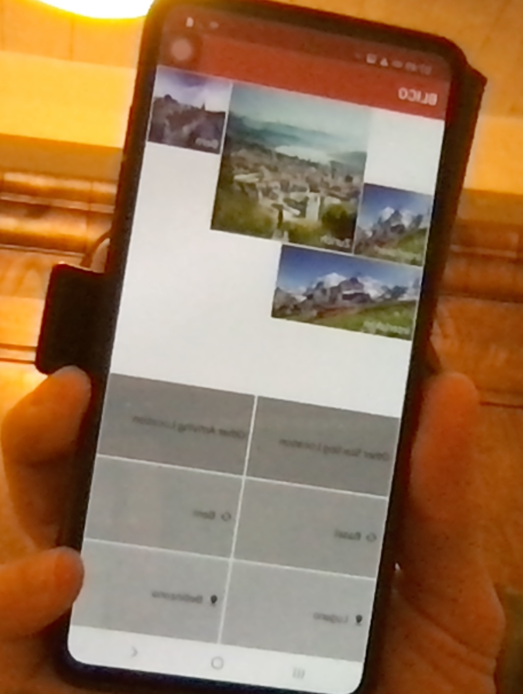

# Blico
Blind companion for Lauzhack 2020 - SBB challenge

Sample detection on images
https://drive.google.com/drive/folders/1NkUUpMSchJwBPQ2dK0-cBXS6_qxHkIQo?usp=sharing

# Deep learning 

## Efficient det 
-use 'sbb2coco.py' which add some missing parts to the data (area, isCrowd, imageSize)
- download https://github.com/google/automl/tree/master/efficientdet
- produce the tfrecord as examplained in tutorial.ipynb
- run training with main.py 
 - run inference with inspect.py
 
 
 ## Yolov5
 
 Very good repo because of the autoresizing anchors, capable of detect both small and big objects precisely.
 
-use 'sbb2yolo.py' which adapt the folder structure and the annotations (xmin,ymin, w, h) to normalize(xmid, ymid, w,h)
- download https://github.com/ultralytics/yolov5
- create config.yaml
```
names:
- "Door button"
- "Open door"
- "Door handle"
- "Door"
nc: 4
train: ../dyolo/images/train
val: ../dyolo/images/val
```
- configure wandb for logging (it's awesome)
- train mutilple model such as small for edge devices, large and xlarge for best performance 
- in our case we trained
```
train.py --img-size 840 --batch 8 --epochs 20 --data config.yaml --weights yolov5x.pt --workers 6
train.py --img-size 420 --batch 32 --resume --epochs 20 --data config.yaml --workers 4
train.py --img 640 --batch 16 --epochs 20 --data config.yaml --weights yolov5l.pt
```
- export the small in jit version for android
- evaluate the labels with which combine the xlarge and large models (exp6 and exp10 in our case) and use tta which further improve performances
```
python detect.py --source ../test/ --weights runs/train/exp6/weights/best.pt runs/train/exp10/weights/best.pt --save-txt --conf-thres 0.4 --save-conf --augment
 ```


# The companion app

Built with Kotlin (the interface) and Java (the camera and classifier) on Android Studio.

- The interface is inspired from SBB's original app, after all this project has the goal of being implemented in their work.



- The camera is pretty simple in the purpose of assuring the UI/UX fluidity. 


Note : This photo is only to show the camera's UI. We tested the pytorch cam on another predective model before impleminting the SBB train, thus the photo.

Implements the AI pytorch model yoloV5s that we trained for this use.


